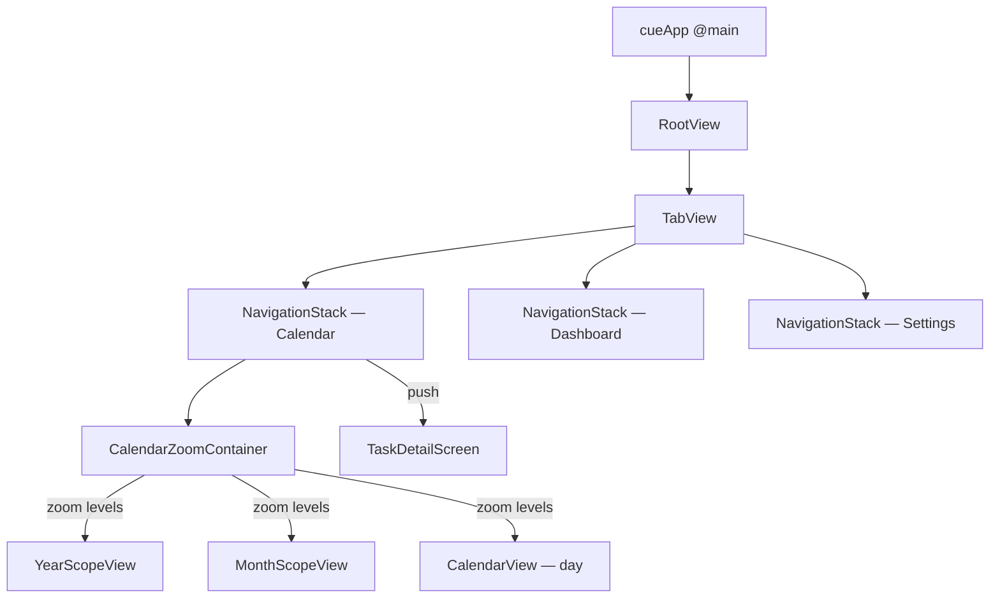

# Cue iOS — Architecture

One-page app overview. For decisions, see [adr/](adr/). For per-feature designs, see [specs/](specs/).

## What this app is

The iOS client for [Cue](../../cue-api/) — a calendar/TODO planner. Native SwiftUI app targeting iOS 26.4, single device target (iPhone). Backend is a NestJS HTTP API; long-term plan includes Siri (App Intents), widgets, and Telegram integration.

## Tech stack

| Concern | Choice |
|---|---|
| Language | Swift (Swift Concurrency — `async`/`await`, actors; `default-isolation=MainActor`) |
| UI | SwiftUI only — see [ADR 0001](adr/0001-swiftui-not-uikit.md) |
| Chrome | Liquid Glass (iOS 26) — automatic, do not hand-roll |
| Persistence | SwiftData (`@Model`) — currently only the Xcode-template stub |
| Deployment target | iOS 26.4 |
| Bundle ID | `makarov.cue` |
| Testing | Swift Testing (macro-based, not XCTest) |
| IDE | Xcode 16+ with `PBXFileSystemSynchronizedRootGroup` (no `project.pbxproj` editing) |

## Project layout

```
cue-ios/
├── cue.xcodeproj/
├── cue/                      ← all source; nested files auto-register via sync group
│   ├── App/                  ← @main entry + root composition
│   ├── Features/             ← one folder per user-facing flow
│   │   ├── Calendar/
│   │   ├── Dashboard/
│   │   └── Settings/
│   ├── DesignSystem/         ← reusable UI primitives + shared components
│   ├── Networking/           ← URLSession-based HTTP client + wire DTOs
│   ├── Models/               ← domain models; SwiftData @Models
│   └── Resources/            ← Assets.xcassets, etc.
├── cueTests/                 ← Swift Testing target
└── cueUITests/               ← UI test target
```

**Folder rule**: Swift folders are organizational only — the compiler treats every `.swift` file as one module. Folders exist for humans. Placement rules:

- Used by exactly one feature → lives **inside** that feature folder.
- Used by two or more features → hoist to the appropriate shared layer (`DesignSystem/`, `Networking/`, etc.).
- Design primitives (color, typography, button styles) → `DesignSystem/` from day one regardless of caller count.
- Default to feature-local; hoist on the third caller.

## UI architecture



- **Root navigation**: `TabView` using the iOS 18+ `Tab(_:systemImage:content:)` DSL.
- **Per-tab navigation**: one `NavigationStack` per tab; value-based `navigationDestination(for:destination:)`.
- **Calendar scopes are zoom levels, not navigation**: `CalendarZoomContainer` hosts year/month/day as one zoomable surface with a continuous, interactive pinch between adjacent scopes — see [ADR 0002](adr/0002-custom-calendar-zoom-container.md). The Calendar tab's `NavigationStack` carries leaf pushes only (task detail).
- **Chrome (Liquid Glass) is automatic** on iOS 26+. **Do not** add `.background(.ultraThinMaterial)` to nav/tab bars; do not mutate `UITabBar.appearance()` / `UINavigationBar.appearance()`; do not hand-roll blur layers. Pre-iOS 26 workarounds now produce wrong visuals. Use `.glassEffect()` for custom elements that should look like glass.

## State patterns

- **Local view state**: `@State`.
- **Shared / cross-view state**: `@Observable` class (iOS 17+ macro). Inject via `@Environment` or pass explicitly.
- **Banned**: `ObservableObject`, `@Published`, `@StateObject`, `@ObservedObject`, Combine in new code, singletons for app state.
- **Data layer**: SwiftData `@Model` classes; `@Query` for reactive reads in views; `@Environment(\.modelContext)` for writes.
- **Concurrency**: `async`/`await` + structured concurrency (`Task`, `async let`, `TaskGroup`). Views run on `@MainActor` by default in Swift 6. Hop to background actors only when you actually need parallelism.
- **Sendability**: respect `Sendable`. No `@unchecked Sendable` to work around it.

## Notifications & loading / error / empty states

An app-wide in-app banner system plus reusable state affordances live in
`DesignSystem/Notifications/` and `DesignSystem/Components/`. `NotificationStore`
(`@Observable`, injected at the root) is the integration point; `NotificationHost`
(mounted in `RootView` via `.notificationHost()`) renders the stack above all
content. Failed requests post error banners via `NotificationStore.postError(_:)`
— collapsed shows a friendly line, expanded reveals the full HTTP diagnostic
(`APIError.userMessage` / `.diagnosticDetail`), with the network→UI bridge kept
one-way in `Networking/AppNotification+APIError.swift`.

When to use a full-page state vs. inline spinner vs. notification vs. alert — see
the decision matrix in [specs/notifications-and-states.md](specs/notifications-and-states.md).

## Networking

URLSession + `async`/`await`. JSON via `Codable`. No third-party HTTP library.

Wire DTOs in `Networking/APIModels.swift` mirror the BE's [OpenAPI contract](../../cue-api/docs/api/openapi.yaml). When the BE adds an endpoint, update the OpenAPI spec first, then mirror it here.

## Data layer (planned)

The legacy `Models/Item.swift` is the Xcode stub. Real model set will mirror the BE schema, translated to SwiftData idioms:

- BE `User` / `Calendar` / `TaskGroup` / `Task` / `RecurrenceRule` / `NotificationStrategy` → `@Model` classes.
- Use `@Relationship` with explicit inverses.
- Avoid redundant FK fields — navigate via the object graph.
- UUIDs are minted on the device (allows offline-first writes; see [BE ADR 0001](../../cue-api/docs/adr/0001-postgres-uuid-pks.md)).

## What NOT to do

| Anti-pattern | Reason |
|---|---|
| UIKit in new code | SwiftUI-only — see [ADR 0001](adr/0001-swiftui-not-uikit.md) |
| Manual transparency / blur on system chrome | Pre-iOS 26 workaround; Liquid Glass is automatic |
| Singletons for app state | Use `@Observable` + `@Environment` |
| Combine in new code | Use `async`/`await` + `AsyncSequence` |
| Force-unwrap (`!`) | Outside of bootstrap/previews/`fatalError` paths only |
| `AnyView` as escape hatch | Erases performance characteristics — use `@ViewBuilder` / `some View` |
| ViewModel class when plain primitives suffice | `@State` / `@Observable` / `@Environment` covers most cases |

## Build

```bash
xcodebuild -project cue.xcodeproj -scheme cue \
  -destination 'generic/platform=iOS Simulator' \
  -configuration Debug build 2>&1 | grep -iE '(warning|error):'
```

After any code change, run the CLI build + grep before declaring success. SwiftUI Preview errors are separate and only surface in Xcode (⌘5).

## What's not built yet

- Tab views are `ContentUnavailableView` placeholders.
- No real SwiftData models — `Item.swift` is the Xcode stub.
- No networking layer wired to the BE.
- No auth — Apple Sign-In + keychain-stored JWT against [BE `/auth/apple`](../../cue-api/docs/specs/auth-apple-signin.md).
- No App Intents (Siri) — see [specs/siri-app-intents.md](specs/siri-app-intents.md).
- No widgets, no CloudKit, no Live Activities, no Dynamic Island.
