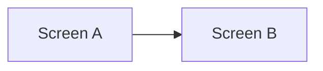

# <Feature / screen name>

- **Status**: Draft | Approved | Implemented | Superseded
- **Last updated**: YYYY-MM-DD
- **Owner**: <name>
- **Related ADRs**: [NNNN](../adr/NNNN-...md)
- **BE counterpart**: [link to cue-api spec, if any]

## Context

What problem does this solve? Who feels the pain today? What constraints exist (deadlines, dependencies, prior decisions, Apple HIG)?

## Goals

What does success look like? Bullet 3–5 outcomes. Each should be observable — "user can X", "screen shows Y", not "code is clean".

- Goal 1
- Goal 2

## Non-goals

What we explicitly are **not** solving here.

- Non-goal 1
- Non-goal 2

## Proposed design

The chosen approach.

### Screen / flow

Wireframe, mermaid flow, or prose description of navigation and interaction. Use `mermaid` for state machines and `flowchart` for navigation.

### Data flow

- What SwiftData models are read / written?
- What network calls are made? (link to [BE OpenAPI](../../../cue-api/docs/api/openapi.yaml))
- What's local-only vs. server-synced?

### State

- Local `@State` vs shared `@Observable`.
- Any view models (only justify if a plain SwiftUI primitive doesn't suffice).

### Edge cases

- Loading / empty / error states (use `ContentUnavailableView`).
- Offline behavior.
- Accessibility (Dynamic Type, VoiceOver labels, reduced motion).

## Alternatives considered

For each rejected alternative: what it was, what made it attractive, the specific reason it lost.

### <alternative 1>

### <alternative 2>

## Rollout

How does this ship? Behind a flag? Replaces an existing screen? Migration of stored data?

## Open questions

- [ ] Question 1
- [ ] Question 2

## References

- Apple HIG sections, sample code, related specs.
