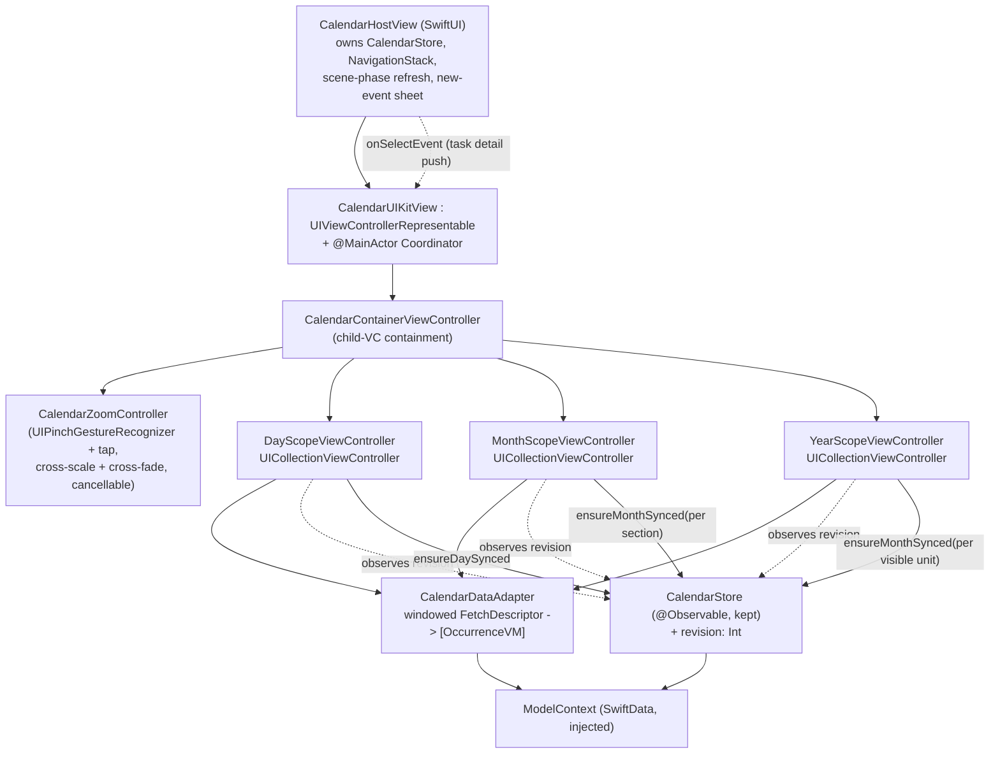

# Calendar — UIKit rewrite

- **Status**: Draft
- **Last updated**: 2026-06-20
- **Owner**: @danil
- **Related ADRs**: [0004](../adr/0004-uikit-calendar.md) (supersedes [0002](../adr/0002-custom-calendar-zoom-container.md); scoped exception to [0001](../adr/0001-swiftui-not-uikit.md))
- **BE counterpart**: none new — same `/tasks`, `/calendars` endpoints.

## Context

The calendar's day/month/year scopes and the pinch-zoom between them were
SwiftUI ([ADR 0002](../adr/0002-custom-calendar-zoom-container.md)). Three
framework limits forced a rewrite (see [ADR 0004](../adr/0004-uikit-calendar.md)):
SwiftUI gesture arbitration can't separate the zoom pinch from scroll pans;
interactive zoom invalidates the view tree every frame; and the scroll model
gave no per-section visibility hook, which let a recurrence-sync bug hide.

The data layer is sound and stays: `CalendarStore` (API↔SwiftData sync),
`TaskItem` (`@Model` occurrence rows), `CalendarMath` (date windows),
`ScheduleEvent` (lightweight view model), `CalendarViewMode`. The design-token
system ([ADR 0003](../adr/0003-design-token-system.md)) stays SwiftUI and is
projected into UIKit.

## Goals

- The three scopes render in UIKit collection views with the existing Kraft &
  Ink visuals; cold launch lands directly on the day scope.
- Pinch **and** tap drive a continuous, cancellable, velocity-aware, retargetable
  cross-scope zoom anchored on the tapped/pinched cell — no gesture fighting.
- Month and year scroll infinitely and smoothly with bounded memory and no
  viewport jump on prepend.
- Recurring occurrences appear in **every** month regardless of scroll speed
  (the sync bug is fixed structurally).
- Theme and Dynamic Type changes re-style the whole calendar live.

## Non-goals

- Changing the backend, the SwiftData schema, or the API contract.
- Rewriting the leaf flows (task detail, new-event, recurrence editor) — they
  stay SwiftUI, reached back through the host.
- Migrating any other SwiftUI surface to UIKit (ADR 0001 still governs them).
- Dark mode (still deferred app-wide).

## Proposed design

### Architecture

One `UIViewControllerRepresentable` (`CalendarUIKitView`) + `@MainActor`
`Coordinator` wraps a `CalendarContainerViewController`. The container uses
child-VC containment to hold the active scope VC and, during a zoom, the
adjacent scope VC. A `CalendarZoomController` owns the pinch recognizer and the
cross-scale/cross-fade animation, anchored on a cell frame the scopes report.

The SwiftUI host (`CalendarHostView`, the `CalendarRootView` replacement) owns
the `CalendarStore`, injects the environment, runs the scene-phase refresh,
owns the `NavigationStack` for leaf task-detail pushes, presents the new-event
sheet, and handles deep-link entry — exactly the responsibilities the old
`CalendarRootView` had. The representable receives the store, model context,
theme, and an `onSelectEvent` callback from the host.

### The three scopes

Each is a `UICollectionViewController` with a compositional layout and a
diffable data source. None uses SwiftUI `@Query`; each fetches via
`CalendarDataAdapter` against the injected `ModelContext` and reacts to
`store.revision` (see Data bridge).

- **Day.** Section per day in a horizontally-paged window; a horizontal week
  strip pinned at top; a floating Jump-to-Today control. Honors
  `CalendarViewMode`: `.timeline` renders an hour-grid layout (reproducing
  `DayScheduleView`'s 24×`hourHeight`=36pt grid, `topPadding`=10, overlap
  columns, current-time indicator); `.list` renders an agenda list. Taps on an
  event card call back to the host to push task detail; the completion toggle
  calls `store.toggleCompletion(occurrenceKey:context:)`. Syncs the visible
  day's month via `store.ensureDaySynced` in `willDisplay`.

- **Month.** Infinitely vertical-scrolling grid of months; one section per
  month; a pinned weekday supplementary header. Each day cell shows the day
  number plus event indicators/titles. Tapping a day asks the container to zoom
  into the day scope anchored on that cell. **Each month section calls
  `store.ensureMonthSynced(month, context:)` in `prefetchItemsAt` / `willDisplay`**
  — idempotent, cheap (early-returns on `syncedMonths`), and independent of
  scroll speed.

- **Year.** Infinitely vertical-scrolling grid; one section per year; each year
  is 12 mini-month grids. Tapping a month zooms into the month scope anchored on
  that mini-grid cell. Each visible year syncs its 12 months (idempotent).

**Infinite scroll (month & year).** A sliding window of sections held in
diffable snapshots. When the user nears an edge, prepend/append a batch of
sections; **on prepend, correct `contentOffset` by the prepended content height
so the viewport doesn't jump**; trim the far edge past a cap to bound memory.
Content-offset *recentering* (keep the window fixed-size, snap offset back to
center) is an acceptable alternative if it proves more robust; the window +
offset-correction approach is the primary recommendation.

### Zoom model

A custom `CalendarZoomController` inside the container — **not** the stock UIKit
`.zoom` nav transition (which can't do interactive bidirectional pinch anchored
on an arbitrary cell). A `UIPinchGestureRecognizer` and cell taps both drive a
single progress scalar between two **adjacent** scopes:

- Inner scope grows out of / collapses into the anchor cell's frame.
- Outer scope counter-zooms and cross-fades.
- The transition is cancellable mid-gesture, velocity-aware (a fling commits
  past threshold), and retargetable (a pinch-open picks the cell under the
  start point).
- The active scope's scrolling is disabled for the transition's duration.
- Gesture arbitration via `UIGestureRecognizerDelegate`: the pinch and the
  active scope's pan are coordinated with `require(toFail:)` /
  `shouldRecognizeSimultaneouslyWith` so they never swallow each other — the
  fix for the SwiftUI version's gesture fighting.

Anchoring: the scope being zoomed *from* (the outer, in a zoom-in tap) reports
the tapped cell's frame in the container's coordinate space; the controller
scales both scopes around that rect. For a pinch-out, the just-mounted outer
scope reports the active unit's cell frame once realized.

### Data bridge

The UIKit scopes do not use `@Query`. Instead:

1. `CalendarDataAdapter` runs a windowed `FetchDescriptor<TaskItem>` against the
   injected `ModelContext` and maps rows to lightweight `OccurrenceVM` value
   structs (derived from `TaskItem`, mirroring today's `ScheduleEvent` mapping).
2. To stay reactive, `CalendarStore` gains an additive observable
   `revision: Int`, bumped after every `context.save()` inside the store. Each
   scope observes it with `withObservationTracking`, **re-registering the
   tracking closure each cycle**, and on change re-runs its windowed fetch and
   applies a fresh diffable snapshot. This replaces SwiftData's `@Query`
   live-update for the UIKit side without coupling to SwiftUI.

This keeps a single source of truth (SwiftData) and a single reactivity
trigger (`revision`), so a completion toggle, sync, edit, or delete refreshes
all three scopes uniformly.

### The recurrence bug fix

Root cause: `MonthScopeView.syncAround` synced only centered ±1 month, but a
fling travels up to ~10 months; gap-months never synced → empty windowed query
→ recurring occurrences vanished.

Fix (primary): **per-section self-sync.** Each month section triggers its own
`store.ensureMonthSynced(month, context:)` as it becomes visible / is prefetched
(`prefetchItemsAt` or `willDisplay`). `ensureMonthSynced` already early-returns
on its `syncedMonths` guard, so this is cheap and guarantees coverage at any
scroll speed. Day and Year scopes likewise sync per visible unit.

Secondary fixes (in `CalendarStore`):
- **(a) Half-open prune range.** `pruneOccurrences` currently deletes on the
  closed `from...to`; the server and the windowed query use half-open
  `[from, to)`. Change the prune to half-open so an occurrence exactly at the
  next month's `startOfMonth` (which belongs to the next window) is not deleted
  by this month's prune.
- **(b) Invalidatable memoization.** `syncedMonths` must be invalidatable so a
  foreground return or an edit can re-sync far months
  (`invalidateAndResync` already removes entries; ensure the per-section path
  and a full-invalidate path can both clear it).

### State

- No SwiftUI `@State` inside the UIKit surface. Scope state (window of section
  ids, selection, view mode mirror) lives on the VCs.
- Shared state stays on `CalendarStore` (`@Observable`, `@MainActor`), read by
  both the SwiftUI host and the UIKit scopes; `revision` is the reactivity edge.
- Theme is a pushed value (`CalendarTheme`), not observed environment.

### Theme bridge

UIKit can't read SwiftUI `@Environment(\.theme)`. A plain value struct
`CalendarTheme` (UIColor / UIFont / CGFloat fields) is built in the
representable from the current `\.theme` `ThemeColors` + the trait collection
(Dynamic Type) and passed into the container and every cell. SwiftUI `Color`
→ `UIColor` via `UIColor(color)`; SwiftUI font tokens (`Typography`,
literal sizes/weights/designs) → `UIFont` via
`UIFont.preferredFont`/`UIFont.systemFont` or the bundled Fraunces by name,
scaled with `UIFontMetrics` for Dynamic Type. The theme is rebuilt and
re-applied in `updateUIViewController` when the SwiftUI theme changes and in
`traitCollectionDidChange` when the content-size category changes.

### Edge cases

- Loading / empty / error: the store already routes request failures to the
  global notification host; empty days/months render an empty state in-cell or a
  background view. No per-screen alert.
- Offline: same as today — the SwiftData cache renders; sync failures notify.
- Accessibility: Dynamic Type via `UIFontMetrics` + trait observation; VoiceOver
  labels on day/month cells, the completion toggle, and Jump-to-Today; respect
  Reduce Motion by shortening/disabling the zoom animation.
- Concurrency: deployment target iOS 26.4, Swift 6 (MainActor-default). All VCs,
  the coordinator, the zoom controller, and the adapter are `@MainActor`.
  Removing the old SwiftUI files clears the two existing concurrency warnings
  they carry; re-run the build after deletion to confirm zero warnings.

## Alternatives considered

### Keep SwiftUI (ADR 0002) and optimize

Single idiom, honors ADR 0001. Lost to framework limits: no gesture-failure
arbitration, no zero-invalidation list mutation, no per-section visibility hook
to fix the sync bug. ADR 0002 pre-authorized this fallback.

### Stock UIKit `.zoom` navigation transition

Free polish, but a fixed two-endpoint push/pop — no interactive bidirectional
pinch anchored on an arbitrary cell, no retarget/cancel. Fails the core UX.

### `UICalendarView`

Month-only, not infinitely scrollable, no cross-scope cell-anchored zoom, can't
host the timeline or Kraft & Ink cards. Solves a smaller problem.

### Drop `revision`, observe SwiftData directly from UIKit

Would re-introduce a SwiftUI dependency (`@Query` needs a SwiftUI view) or a
manual `ModelContext` change-notification scheme that's heavier than a single
monotonically-bumped integer. `revision` is the minimal additive trigger.

## Rollout

Replaces the existing calendar surface wholesale (no flag): the new
`CalendarHostView` is wired into `RootView`'s calendar `Tab` in place of
`CalendarRootView`, and all listed SwiftUI scope files are deleted in the same
change. No stored-data migration — the SwiftData schema is unchanged. Build must
stay green throughout.

## Open questions

- [ ] Day scope horizontal paging: one collection view paging horizontally vs. a
      page-VC-style window — pick during Day implementation.
- [ ] Exact prepend batch size / window cap per scope (tune against the old
      `seedRadius`/`maxWindowSize` constants).
- [ ] Reduce-Motion zoom: shorten vs. cross-dissolve-only.

## References

- [ADR 0004 — UIKit calendar](../adr/0004-uikit-calendar.md)
- [specs/calendar-performance-and-zoom.md](calendar-performance-and-zoom.md)
- [specs/design-tokens.md](design-tokens.md)
- Apple — `UICollectionViewCompositionalLayout`, `UICollectionViewDiffableDataSource`, `UIViewControllerRepresentable`, `UIGestureRecognizerDelegate`, `UIFontMetrics`
