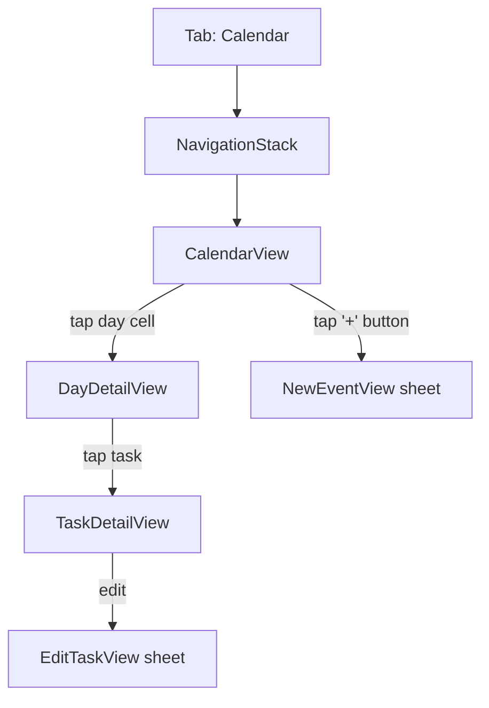

# Calendar view

- **Status**: Draft (placeholder UI exists; real implementation pending)
- **Last updated**: 2026-05-31
- **Owner**: @danil
- **Related ADRs**: [0001 — swiftui-not-uikit](../adr/0001-swiftui-not-uikit.md)
- **BE counterpart**: [auth-apple-signin](../../../cue-api/docs/specs/auth-apple-signin.md) (gates the data); recurrence model lives in [BE ADR 0002](../../../cue-api/docs/adr/0002-rrule-not-materialized.md)

## Context

The Calendar tab is the primary surface of Cue — where users see what they have to do, when. Today it's a `ContentUnavailableView` placeholder. The BE owns the canonical Task data; the iOS client renders it and offers create/edit/complete affordances.

## Goals

- User sees their tasks/events laid out on a familiar calendar surface.
- Three time granularities: day, week, month. Default = day.
- User can create a new task from the calendar view (via the existing `FloatingAddButton` → `NewEventView` sheet).
- User can tap a task to view/edit it.
- User can swipe-to-complete a task on the day view.
- Recurring tasks display each occurrence, sourced from the BE's expanded view (the BE expands RRULE; the iOS client does not re-expand).
- Time-zone correct — a task whose `timezone` differs from the device's current locale displays in the *task's* timezone with a subtle indicator.

## Non-goals

- Year view.
- Drag-to-move tasks across days (defer to v2).
- Inline editing in the cell (use sheet).
- Multi-day event spans rendered as horizontal bars (v2 — start with single-day pills).
- Calendar sharing UI (no BE support yet).
- Offline writes (defer until SwiftData + sync are in place).

## Proposed design

### Screen layout

`CalendarView` is the top-level destination. It hosts:

1. A **mode picker** at the top (Day / Week / Month) — `Picker` with `.segmented` style.
2. The active **mode view** — `DayView`, `WeekView`, or `MonthView` (separate SwiftUI views switched by enum).
3. A **floating "+"** to create a task (`FloatingAddButton` already exists in DesignSystem).

### Data flow

- Read: `@Query` on the local SwiftData store for `Task` rows in the visible range. Background sync (separate spec) refills the store from the BE.
- Write: `@Environment(\.modelContext)` for completion toggles + new tasks created from the sheet.
- The view never calls the network directly — that's the sync layer's responsibility.

### State

- `@State private var mode: CalendarMode = .day` — local to the view.
- `@State private var anchorDate: Date = .now` — currently focused day/week/month.
- `@Query` parameterized by `anchorDate` + `mode` for the visible task set.
- No view model class — plain SwiftUI primitives suffice.

### Empty / loading / error states

- Empty (no tasks in view): `ContentUnavailableView("No tasks", systemImage: "calendar.badge.plus")` with a CTA opening `NewEventView`.
- Loading: SwiftData `@Query` is synchronous against the local store; if the local store is empty during initial sync, render a `ProgressView` with shimmer placeholders.
- Error: surfaces from the sync layer via an environment-injected `SyncStatus` observable. Show a small banner; don't block the calendar UI.

### Accessibility

- Each day cell exposes a VoiceOver label: "May 31, Saturday, 3 tasks".
- Each task pill: "9 AM, Standup, not completed".
- Dynamic Type: pills truncate gracefully; day grid relaxes to scrollable list at XXL.
- Reduced motion: skip the cross-mode transition animation.

## Alternatives considered

### Use `Calendar` framework + `UIKit`'s `UICalendarView` wrapped in `UIViewRepresentable`

Provides Apple's stock month grid for free. Rejected because:
- Conflicts with [ADR 0001](../adr/0001-swiftui-not-uikit.md) — UIKit only as last-resort escape hatch.
- We need per-cell content (task pills) — `UICalendarView`'s decorations API is limited.
- A native SwiftUI grid using `LazyVGrid` is not significantly more code and is fully styleable.

### A 3rd-party library (e.g. `SwiftUICalendar`)

Faster start. Rejected because:
- Our calendar surface is a core differentiator; we want full control over visual + interaction polish (Liquid Glass integration, custom recurrence rendering).
- Adds a dependency for a thing we'd reimplement to taste anyway.

### One view, mode controlled by an enum vs. three separate destinations

Considered making Day/Week/Month separate navigation destinations. Rejected — mode-switching feels instantaneous in user mental model, not a navigation transition.

## Rollout

1. Build `DayView` first (highest-information surface, simplest layout).
2. Wire `FloatingAddButton` to present `NewEventView`.
3. Add `WeekView`, then `MonthView`.
4. Replace tab placeholder with `CalendarView`.

No feature flag — ships as the new default once the day view is presentable.

## Open questions

- [ ] How does the day view render an all-day task vs. a timed task? (Pinned top section vs. inline at top-of-hour.)
- [ ] Multi-timezone tasks: indicator placement (pill suffix? small badge?).
- [ ] Swipe-to-complete on past occurrences of recurring tasks — does completing one occurrence dismiss the next?
- [ ] Initial-load UX before any local sync has happened.

## References

- Existing placeholder: [`cue/Features/Calendar/CalendarView.swift`](../../cue/Features/Calendar/CalendarView.swift)
- Add-event flow: [`cue/Features/Calendar/NewEvent/`](../../cue/Features/Calendar/NewEvent/)
- BE recurrence model: [ADR 0002 — rrule-not-materialized](../../../cue-api/docs/adr/0002-rrule-not-materialized.md)
- Apple HIG — Calendars: https://developer.apple.com/design/human-interface-guidelines/calendars
