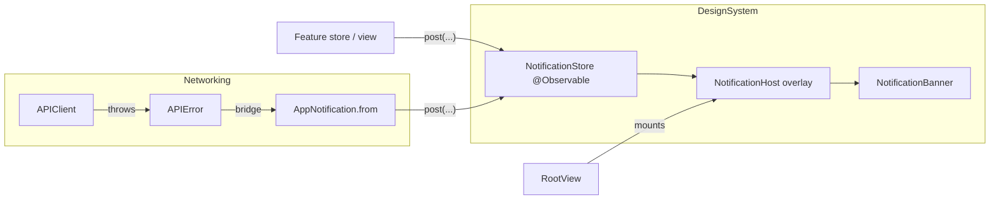

# Notifications & loading / error / empty states

- **Status**: Implemented
- **Last updated**: 2026-05-31
- **Owner**: Cue iOS
- **Related ADRs**: [0001](../adr/0001-swiftui-not-uikit.md)
- **BE counterpart**: error envelope is [`ValidationErrorBody`](../../../cue-api/docs/api/openapi.yaml)

## Context

The app fetches everything from the NestJS backend, so requests fail: offline,
timeouts, validation errors, expired sessions. Before this feature every feature
store kept its own `errorMessage: String?` and surfaced it with a one-off
`.alert`. That was inconsistent (different copy per screen), modal (interrupts
the user), and threw away the diagnostic detail (status code, response body) the
user/developer needs to understand the failure.

We also had no shared vocabulary for **loading** and **empty** states — each
screen hand-rolled a spinner.

## Goals

- A single, app-wide way to surface transient messages (a "toast"/banner stack).
- Errors show a friendly one-liner; the full diagnostic is one tap away.
- Reusable, design-system-owned loading / error / empty affordances.
- A documented decision matrix so contributors know *which* state pattern to
  reach for.
- Keep the design system decoupled from networking — the network layer emits
  errors; a thin bridge maps them onto generic notification payloads.

## Non-goals

- OS-level push / local notifications (`UNUserNotificationCenter`). This is
  purely **in-app** UI. The name "notification" here means an in-app banner.
- A persistent notification center / history. Banners are ephemeral.
- Per-screen bespoke error pages beyond the one reusable `ErrorStateView`.

## Architecture



Dependency direction is one-way: **Networking → DesignSystem**. The store and
banner never import `APIError`; the bridge (`AppNotification+APIError.swift`,
which lives in `Networking/`) adapts it into a generic `AppNotification`.

### Files

| File | Role |
|---|---|
| `DesignSystem/Notifications/AppNotification.swift` | Value-type payload + `NotificationSeverity` / `NotificationDismissal` + factories. |
| `DesignSystem/Notifications/NotificationStore.swift` | `@Observable @MainActor` queue. Owns timers + expansion state. **The integration point.** |
| `DesignSystem/Notifications/NotificationBanner.swift` | Dumb single-banner view (glass, severity rail, expand, close). |
| `DesignSystem/Notifications/NotificationHost.swift` | Overlay that renders the stack; `.notificationHost()` modifier. |
| `DesignSystem/Components/ErrorStateView.swift` | Reusable full-page error (`ContentUnavailableView` + retry). |
| `DesignSystem/Components/LoadingStateView.swift` | `LoadingStateView`, `InlineLoadingRow`, `.loadingOverlay(_:)`. |
| `Networking/AppNotification+APIError.swift` | Bridge: `APIError` → `AppNotification`; `NotificationStore.postError(_:)`. |
| `Networking/APIClient.swift` | `APIError` gains `userMessage` (friendly) + `diagnosticDetail` (full). |

The store is injected in `cueApp.swift` (`.environment(notifications)`) and the
host is mounted in `RootView` via `.notificationHost()`, so banners float above
every screen — loading, auth, and the tabbed app alike.

## Notification model

An `AppNotification` carries `severity`, `title`, optional `message` (collapsed
supporting line), optional `detail` (revealed on expand), a `dismissal` policy,
and an `isExpandable` flag.

### Severity

`info` · `success` · `warning` · `error` — each maps to an SF Symbol, a tint
color, and a VoiceOver prefix. Drives styling only; carries no behavior.

### Dismissal behavior

- **Auto-dismissing** (`.auto(seconds:)`, default 4s): on `post`, the store
  spawns a cancellable `Task` that `Task.sleep`s then removes the notification.
  Manual dismissal or expansion **cancels** that task so it never fires twice.
  Used for `info` / `success`.
- **Permanent** (`.permanent`): no timer; stays until the user taps close or
  swipes up. Used for `warning` / `error` (the user must acknowledge).

### Expandable on tap (opt-in)

`isExpandable` defaults to `true` **iff** a `detail` string was supplied (you
can force it off). Tapping an expandable banner calls
`NotificationStore.toggleExpanded(_:)`, which reveals `detail` and cancels any
auto-dismiss timer (you're reading — it shouldn't vanish). Expansion state lives
in the store, not the view, so it survives re-renders and is testable.

## API errors → notifications

`APIError` now exposes two strings:

- `userMessage` — friendly, collapsed. Parses the BE envelope
  `{ statusCode, message, error }` (message may be a `String` *or* `[String]`)
  so the user sees the server's own validation text, falling back to a
  status-family generic ("Your session has expired", "The server ran into a
  problem", …).
- `diagnosticDetail` — the full picture for the expanded view: `HTTP <status>` +
  raw response body, or the transport / decoding description.

`errorDescription` (LocalizedError) stays equal to `userMessage`, so the
remaining inline `.alert` call sites keep working unchanged.

A feature surfaces a failure in one line:

```swift
notifications.postError(error, title: "Couldn't load your tasks")
```

`postError` builds a **permanent, expandable error** banner. Collapsed it shows
the title + `userMessage`; expanded it shows `diagnosticDetail`. Non-`APIError`
throwables still surface (wrapped with `localizedDescription` + a reflected
detail). `CalendarStore` is wired this way today.

## Loading / error / empty decision matrix

Pick the lightest affordance that fits. The rule of thumb is **scope** (whole
screen vs. part) × **cause** (no content yet vs. a failed interaction).

| Situation | Use | Why |
|---|---|---|
| App boot, validating session | `LoadingView` (branded splash) | One-time, full-screen, on-brand. Not for content. |
| A whole screen/section has **no content yet** while its first fetch runs | `LoadingStateView` | Centered spinner fills the empty area. |
| More items streaming into existing content (pagination, bg sync) | `InlineLoadingRow` | Non-blocking footer; user keeps reading. |
| A blocking refresh **over content already on screen** | `.loadingOverlay(_:)` | Dimmed glass spinner; preserves context. |
| The screen's **primary load failed** and there's nothing to show | `ErrorStateView` (with `retry`) | Full-page, recoverable dead-end. |
| A **transient interaction** failed (save, toggle, background sync) | `NotificationStore.postError(...)` banner | Non-modal; user keeps their place; detail on tap. |
| A query legitimately returned **nothing** | `ContentUnavailableView` (or `ErrorStateView` w/o retry) | Empty ≠ error; no spinner, no alarm. |
| A **modal form** submission failed | inline `.alert` on the sheet | Host overlay can sit *behind* a sheet; keep the error where the user's focus is. |

Guidance:

- **Full-page state** when the user has nothing else to look at.
- **Inline spinner** when content exists and you're just adding to it.
- **Notification** for the result of an action the user took, when they should
  stay where they are. Default to this for sync/mutation failures.
- **Never** use a blocking `.alert` for a background failure — it interrupts.
- Empty states are not errors: no red, no spinner, offer the next action.

## Edge cases

- **Overflow**: the store caps simultaneously-visible banners (`maxVisible`, 4);
  oldest are trimmed (and their timers cancelled).
- **Accessibility**: banners combine children into one VoiceOver element labeled
  "<Severity>. <title>. <message>", with a hint for the expand affordance and a
  separate "Dismiss notification" button. `detail` is `.textSelection(.enabled)`
  so users can copy diagnostics.
- **Liquid Glass**: banners and the loading overlay use `.glassEffect()` — never
  hand-rolled blur/material (see [ADR 0001](../adr/0001-swiftui-not-uikit.md)).
- **Gestures**: swipe-up dismisses (natural for a top-anchored banner); the
  overlay is hit-testable only where banners actually are, so it never blocks
  the app underneath.

## Alternatives considered

### Per-screen `.alert` (status quo)

Already in use. Modal and interrupting; inconsistent copy; loses diagnostic
detail; can't stack. Kept **only** for modal-form submission errors, where the
host overlay may be occluded by the sheet and the error belongs next to the
user's focus.

### A singleton toast manager

Simplest to call from anywhere, but violates the repo's "no singletons for app
state" rule. `@Observable` + `@Environment` gives the same ergonomics with
testable, injectable state.

### Coupling the store to `APIError`

Would let `postError` live on the store directly with zero bridge. Rejected: it
drags the network layer into the design system. The generic-payload + bridge
split keeps `DesignSystem/` reusable in isolation.

## How to trigger a test notification

In **DEBUG** builds, Settings shows a **"Developer · Notifications"** section
(`SettingsView.NotificationDebugSection`) with one button per variant —
auto-dismiss info/success, permanent warning, an **expandable error** built from
a fake `422` validation body, and "Clear all". Compiled out of release builds.

In real use, error banners fire automatically when a wired request fails (e.g.
turn off networking, open the Calendar tab → "Couldn't load your tasks" appears;
tap it to expand the HTTP detail).

## Open questions

- [ ] Should `success` banners be suppressed under Reduce Motion / a "quiet"
      preference? Deferred until there's a settings surface for it.
- [ ] Telegram / push notification surfaces will reuse `NotificationSeverity`
      but are out of scope here.

## References

- Apple HIG — *Notifications*, *Loading*, *Empty states*.
- [`ContentUnavailableView`](https://developer.apple.com/documentation/swiftui/contentunavailableview)
